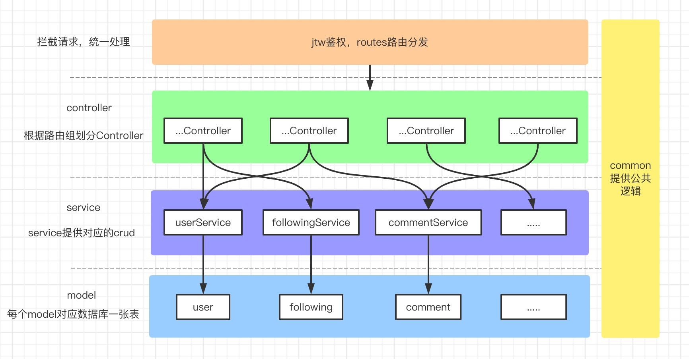

# douyin-main

原项目：Henrik-Yao/douyin

## 连接数据库

与主程序的同级目录，创建配置文件 `conf/application.yaml`：

```yaml
url: IP
port: PORT
username: ...
password: ...
database: ...
```

配置文件在服务器的 `/usr/local/douyin/conf` 目录，需要在 `/usr/local/douyin` 路径下启动程序。

## 投稿

目前的投稿功能是把视频存在本地，设置的一个媒体文件路径下。

即：服务端程序同级路径下的 `media/{video,img}`

# douyin

字节跳动青训营抖音项目后端接口


架构图如下：



汇报文档地址：https://qnac8r4ct8.feishu.cn/docx/doxcnuqAvswArqpJqe3gPJJCYeh?from=from_copylink

